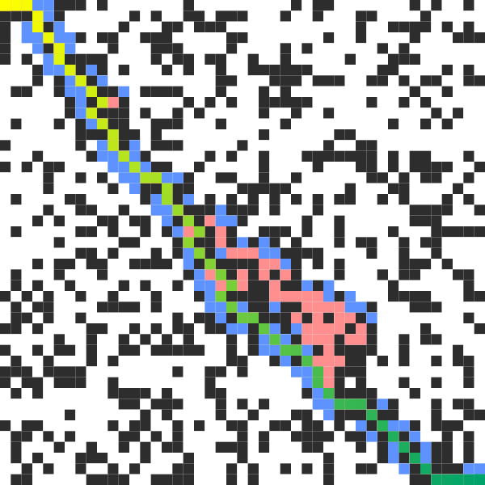
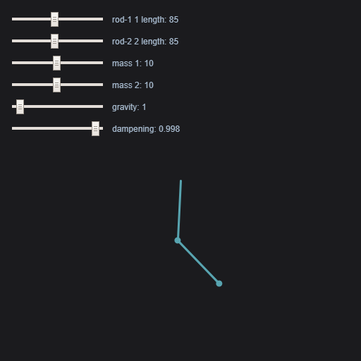
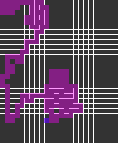
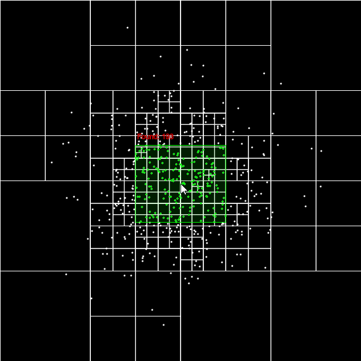
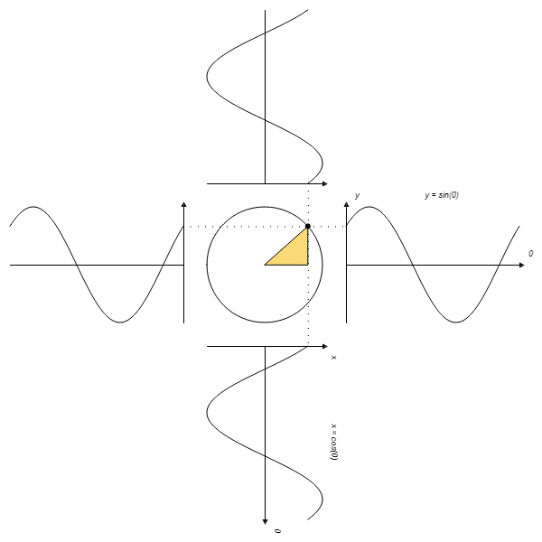
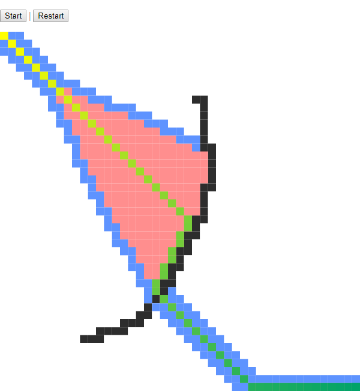
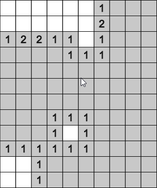

# p5.js Sketches

**Blank Template** available in `_BLANK_`

Random sketches based on tutorials and from my free time.

---

### Previews

*click image to view live example*

#### A* Pathfinding (**[view code](https://github.com/donwilson/p5js-sketches/a_star/)**)

#### Double Pendulum (**[view code](https://github.com/donwilson/p5js-sketches/double_pendulum/)**)

#### Maze Generator (**[view code](https://github.com/donwilson/p5js-sketches/maze-generator/)**)

#### QuadTree (**[view code](https://github.com/donwilson/p5js-sketches/quadtree/)**)

#### Sine & Cosine (**[view code](https://github.com/donwilson/p5js-sketches/sine-cosine/)**)

#### A* Pathfinding (w/live drawing) (**[view code](https://github.com/donwilson/p5js-sketches/a_star/)**)

#### Minesweeper (**[view code](https://github.com/donwilson/p5js-sketches/minesweeper/)**)

